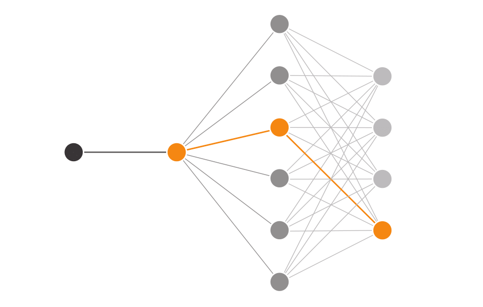

# Notes on forward and backward propagation in deep neural networks

The goals of these notes are twofold:

- expressing mathematically the procedures of forward and backward propagation;

- getting familiar with the notation employed in a full vectorized form of these operations, over features, hidden units, output units and training examples.

To the formality oriented, as myself, it is evident that forward and backward propagation are some complicated forms of function composition and chain rule application, respectively. However, these are not arbitrary instances of these mathematical rules. There is an underlying diagrammatic representation that defines the neural network and which we should take advantage of, but also that limits the class of functions expressible as the result of forward propagation. The generic architecture of a deep neural network is shown in the following figure. We count the total number of layers including the output layer but excluding the input layer. Therefore a neural network with L layers consists of one input layer, followed by L-1 hidden layers, followed by an output layer.


## Forward propagation

Let us consider the simplest case of a deep neural network, that with a single hidden layer and a single output unit, appropiate for a binary classification problem (see next image). At the moment, we are going to consider only one training example  with  arranged as a column vector with  entries and  a single classification output, as

<p align="center"></p>


The first and only hidden layer has  units, which are activated by a function  (tanh, relu or sigmoid, for example) and the output unit is activated by a function . The diagrammatic picture is the following. The circles in the input layer, also called the input units, represent each a feature , so we have in total  units. The following column of circles represent the units in the hidden layer.


Consider a single unit  in the hidden layer. This receives as input the units from the preceding layer and outputs a real function , so that
<p align="center"></p>
which is produced by first computing
<p align="center"></p>
followed by the activation function \chi^{[i]}, so that
<p align="center"></p>
where  is a  matrix and  is a  matrix. And this happens for each unit in the hidden layer. Finally, the output unit performs the same action, takes as input the activation units from its preceding layer and outputs
<p align="center"></p>
where now  is a  matrix and  is a  matrix. The output  can be seen as . This can be considered as a function  with parameters , , ,  when, which varied, generate an entire subclass of functions in function space.

## Optimization task

Let us define the loss function
<p align="center"></p>
This function penalizes that  differs from . For example, if the true label is 1 and the output unit gives 0, the loss function returns infinity, while if the output unit produces a 1, the loss is 0. We fix  and consider the optimization task of finding the parameters , , 1,  that minimize the loss function. This is achieved by starting from a random point in the space of parameters and following the path of greatest descent until some minimum is found. Since the surface over parameter space corresponding to the loss function is not convex, this minimum might be a local minimum. Random initialization allows to arrive at the global minimum. The path of greatest descent parameterized by  is defined by
<p align="center"></p>
where  is some parameter and  is the metric in these coordinates. Therefore, it is important that we obtain an expression for the derivates of  with respect to parameters.

## Backward propagation
\noindent Let us first consider the derivatives of  with respect to parameters in the second layer, , . Typically the output unit is activated with the sigmoid function , which satisfies . We have then
<p align="center"></p>
That was easy. Let us now compute the derivatives of the loss function with respect to farther parameters, those in the first layer, , . In this case,
<p align="center"></p>

In order to formulate a vectorization over features and units of the previous expressions, we consider the following. First, the series of derivatives along a set of parameters will be contained in an object of the same form as those parameters. For example, since  is a  matrix, then  should be of the same form. Additionally, we define an operation  ocurring between matrices of the same and denoting element-wise multiplication. Then a vectorization is given by
<p align="center"></p>
as well as
<p align="center"></p>




Let us express the previous results from a diagrammatic perspective, considering the figure above. Let us sit at the output unit, where the variation in the loss due to a variation in the linear output  is . Then we append that value to that unit's output. Then, going backward, we consider the line that joins the output unit with the -th unit from the hidden layer. This line contributes with the weight , whose variation produces a variation in the loss. Then we only multiply the value from the left with the activation , the same as for the bias unit activation (which equals one). As we go on, from the -th unit in the hidden layer to the -th unit in the input layer, we multiply first by  and second by the activation  or by one for the bias unit.

## Vectorizing over  examples
\noindent We now include in the  matrix  all the training examples with each training  example as column vector. We also consider  vector  as consisting of all the training results. Then we have
<p align="center"></p>
We consider . Then \textbf{forward propagation} consists in the following series of steps:

- linear propagation to the first layer (yielding a  matrix):
<p align="center"></p>
- unit activation in the first layer:
<p align="center"></p>
- linear propagation to the second layer (yielding a  matrix):
<p align="center"></p>
- unit activation in the second layer:
<p align="center"></p>

We define   as a  matrix full of 1's, which can be programmed through broadcasting operations. We compute the \textbf{cost function} as the average of the individial losses over all examples as
<p align="center"></p>
Finally, \textbf{backward propagation} is performed through the following series of steps:
\begin{enumerate}
- output layer linear variation:
<p align="center"></p>
- weights and biases variations in the second layer:
<p align="center"></p>
- hidden layer linear variation:
<p align="center"></p>
- weights and biases variations in the second layer:
<p align="center"></p>


## Generalizing to arbitrary number of hidden layers
From the preceding discussion, it is straightforward to derive a generalization to a neural network with an arbitrary number of layers. Let us consider a neural network with the following architecture:


```
